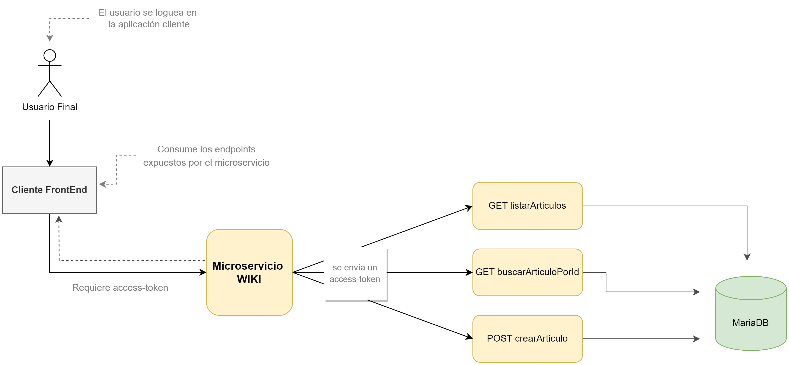

##  Microservicio - WIKI

Este microservicio tiene como finalidad exponer diferentes servicios para la administración de una Wiki. El mismo es consumible por cualquier cliente Web. 
La Wiki tendrá un formato colaborativo.

### Diagrama de Arquitectura

#### Collection de Postman

Se disponbiliza el link de la collection con servicios expuestos. https://www.getpostman.com/collections/04827ab751db1cf22be7
